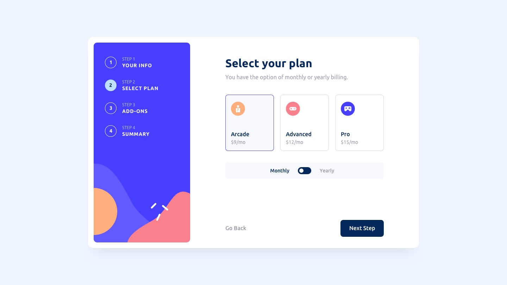

# Frontend Mentor - Multi-step form solution

This is a solution to the [Multi-step form challenge on Frontend Mentor](https://www.frontendmentor.io/challenges/multistep-form-YVAnSdqQBJ). Frontend Mentor challenges help you improve your coding skills by building realistic projects.

### Electron

On branch `electron` you can find electron version

###

On branch `electron` you can find electron version

### Screenshot



### Links

- Live Site URL: [Add live site URL here](https://szymii.github.io/Multi-step-form/)

## My process

### Built with

- HTML5 - (no frameworks)
- CSS - (no tailwind / SCSS)
- Mobile-first workflow
- E2E test with [Playwright](https://playwright.dev/)
- [XState](https://xstate.js.org/) - state management and orchestration solution for JavaScript and TypeScript apps

### What I learned

The aim of this project was twofold: to refresh my skills in pure CSS and to delve into the capabilities of XState

### pushing to gh-pages

```bash
git add dist -f
git commit
subtree push --prefix dist origin gh-pages
```
